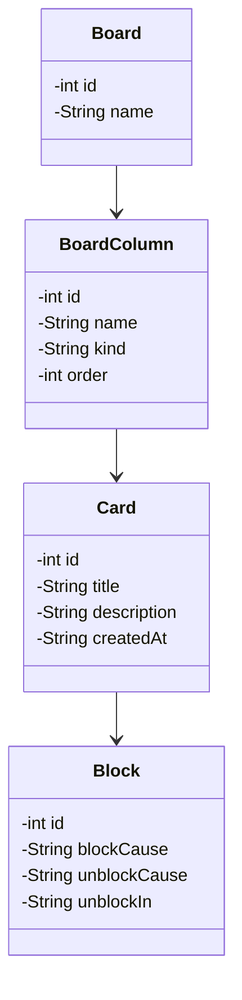

# Criando um Board com persistência de Dados

## Diagrama de Classes

```mermaid
classDiagram
    class Board {
        -int id
        -String name
    }

    class BoardColumn {
        -int id
        -String name
        -String kind
        -int order
    }

    class Block {
        -int id
        -String blockCause
        -String unblockCause
        -String unblockIn
    }

    class Card {
        -int id
        -String title
        -String description
        -String createdAt
    }

    Board --> BoardColumn
    BoardColumn --> Card
    Card --> Block
    
```
